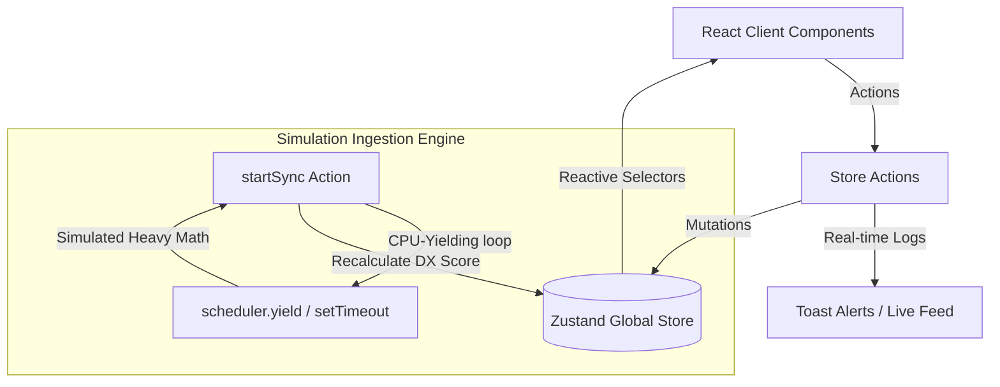

# NordicFlow

NordicFlow is a production-style Next.js SaaS demo for engineering intelligence across frontend teams.

## Features
- Engineering health dashboard (lead time, PR size, pass rate)
- Repository intelligence with DX score and throughput signals
- PR risk analysis model (low/medium/high)
- CI build health snapshots
- Demo workspace for instant exploration
- REST API scaffolding for GitHub auth and repository sync

## Tech Stack
- Next.js App Router + TypeScript
- Tailwind CSS
- TanStack Query + Zustand (ready to wire in UI hooks)
- Recharts (ready for chart expansion)
- Vitest testing

## Setup
```bash
npm install
npm run dev
```

## Commands
```bash
npm run dev
npm run build
npm run test
npm run typecheck
```

## Demo
Open `http://localhost:3000/demo` for the seeded Northwind Labs workspace.

---

## System Architecture & Systems Thinking

NordicFlow is architected with a decoupled state layout designed to model a modern real-time SaaS platform.



### Zustand Store State Machine
- **State Hydration**: Manages simulated organization-wide user profile state and token status.
- **Repository Metadata**: Dynamic workspace store tracking DORA metrics (Lead Time to Deploy, DX Score, Average PR Size, Test Suite Pass Rate).
- **Interactive Event Ingestion**: Live dispatchers (`addPullRequest`, `addBuild`) calculate metric adjustments in real time, triggering warning banners and error logs on the Activity Feed.

### Interaction to Next Paint (INP) Optimization
To demonstrate frontend product engineering maturity, the repository synchronization static-analysis engine leverages an asynchronous CPU-yielding pattern:
- Heavy static analysis computations are simulated in chunks.
- Every 50ms, execution yields control back to the browser main thread via `scheduler.yield()` (with a fallback to `setTimeout(resolve, 0)`).
- This keeps the browser highly responsive, preventing Long Tasks (>50ms) and keeping INP low.

---

## Testing & Quality Culture

We maintain a production-grade testing suite utilizing **Vitest**, **React Testing Library**, and **JSDOM** to ensure stability across state mutations and layout components.

### Coverage Areas
1. **Store Integration Tests (`tests/store.test.ts`)**: Verifies 10 core behaviors including auth flows, repository additions/deletions, PR alerts on size targets, and sandbox state factory resets.
2. **React Component Unit Tests (`tests/components.test.tsx`)**: Validates layout rendering for `AppShell` (including desktop sidebar and profile drawers) and data presentation in `MetricCard`.
3. **Data Integrity (`tests/mock-data.test.ts`)**: Validates seeded workspace mock records.

### Running the Test Suite
Execute the test suites locally:
```bash
npm run test
```

---

## Project Scope & Architectural Roadmap

NordicFlow is designed as a **high-fidelity client-side architectural prototype and frontend demo**. 

To make this portfolio project **instantly exploratory** for recruiters (zero setup friction, no local database installations, and no GitHub OAuth credentials required), the entire system runs locally inside the browser.

### Current Implementation (High-Fidelity Client-Side MVP)
* **Zustand State & Calculation Engine**: All calculations (DX Score, DORA metrics like Lead Time and Pass Rate) are executed in real time in the Zustand store.
* **Seeded Sandbox Data**: Preloaded with a complete engineering dataset representing a simulated workspace (Northwind Labs) for immediate exploration.
* **Simulated Control Panels**: Interactive PR and CI/CD build event simulators update the client store instantly to demonstrate real-time notifications, calculations, and AI assistant summarizations.
* **REST API Scaffolding**: Structured API Route Handlers (`app/api/*`) are scaffolded (e.g. `/api/auth/github`, `/api/repos`) to model the endpoints and JSON payloads for a future backend connection.

### Future Development Roadmap
To transition from a client-side prototype to a multi-tenant production platform:

1. **Phase 2: Persistent Backend Services**
   - Replace Next.js simulated routes with a standalone Node.js Fastify or Elixir Phoenix API server.
   - Configure a PostgreSQL database using Prisma ORM to persist repository metadata, user logs, and workspace preferences.
2. **Phase 3: Real GitHub Integration**
   - Register a real GitHub App to replace the simulated Organization connection.
   - Add a GitHub Webhook handler endpoint to parse real repository events (PR opened/merged, CI/CD run outcomes) and calculate live metrics automatically.

---

### Feature Status & Implementation Breakdown

| Feature / Screen | Scope | Implementation |
| :--- | :---: | :--- |
| **Landing Page (`/`)** | Frontend | Premium Outfit/Inter typography, DX features grid, and preview KPI cards. |
| **App Layout Shell (`AppShell`)** | Frontend | Nav routing, active states, and real-time notifications bell drawer. |
| **Engineering Dashboard (`/dashboard`)** | Frontend | Dual Y-axis ComposedChart metrics, workspace filters, and dynamic AI-assistant summaries. |
| **Repository Directory (`/repos`)** | Frontend | Codebase directories, inline registration, search, and deletion action dispatchers. |
| **PR Risk Analysis Screen (`/repos/[id]`)** | Frontend | Complexity indicators, PR review delays, and interactive event simulator panels. |
| **Demo Workspace (`/demo`)** | Client Store | One-click entry that seeds the Zustand store with default sandbox repository datasets. |
| **API Endpoints Scaffolding** | Stubbed API | Next.js API route templates modeling HTTP JSON schemas for future DB connections. |

